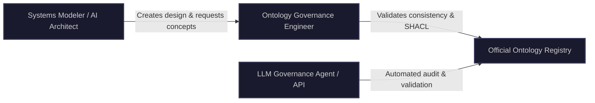

# Enterprise Ontology Governance & Extension Guide

This guide establishes the formal governance, extension, and validation protocols for aligning Model-Based Systems Engineering (MBSE) architectures (UAFv2 / UAFSML) with standard upper and domain ontologies (SUMO, W3C ORG, OMG BMM, EMMO/BattINFO).

---

## 1. Semantic Governance Framework & Roles

To maintain logical consistency and completeness, a three-layered governance team is established:



*   **Ontology Governance Engineer:** Responsible for vetting external ontologies, maintaining the bridge ontologies, and resolving logical reasoning conflicts (disjointness).
*   **Systems Modeler / Enterprise Architect:** Responsible for creating architecture models and aligning model elements to approved ontologies.
*   **LLM Governance Agent (API):** An automated AI agent that audits models during checkout/commit, suggests mappings to existing ontologies, and flags structural syntax errors.

---

## 2. Core Governance Use Cases

### Use Case 1: Concept Selection (Search & Mapping)
*   **Actor:** Systems Modeler or LLM Agent.
*   **Goal:** Bind a SysML v2 block definition to a formal, dereferenceable ontology concept.
*   **Workflow:**
    1.  User creates a SysML v2 part definition (e.g., `part def 'LithiumSulfurCell'`).
    2.  The lookup plugin queries the local ontology registry or BioPortal API for "Lithium Sulfur Cell".
    3.  The system identifies `battinfo:LithiumSulfurCell` as the closest formal match.
    4.  An owl:Individual is generated with an instantiation relation:
        `ev:inst-sulfur_cell rdf:type battinfo:LithiumSulfurCell .`

### Use Case 2: Controlled Extension
*   **Actor:** Ontology Governance Engineer or LLM Agent.
*   **Goal:** Subclass or extend a standard domain class without modifying the official read-only ontology.
*   **Workflow:**
    1.  The engineer creates a company-specific extension ontology (e.g., `ev_power.ttl`) that imports the base ontology (`battinfo.ttl`).
    2.  The extension class is declared and mapped:
        ```turtle
        ev:SolidStateBattery rdf:type owl:Class ;
            rdfs:subClassOf battinfo:BatteryCell ;
            rdfs:label "Solid State Battery Cell" ;
            rdfs:comment "Custom organizational extension for solid-state electrolyte battery technology." .
        ```
    3.  The HermiT reasoner is executed to ensure the new subclass does not violate any disjointness axioms in the parent ontologies.

### Use Case 3: Automated Validation (CI/CD Pipeline)
*   **Actor:** LLM Agent / API or GitHub Actions Runner.
*   **Goal:** Prevent inconsistent or unmapped models from being merged into the master enterprise architecture database.
*   **Workflow:**
    1.  Modeler submits a pull request with new SysML v2 / UAFSML instances.
    2.  The pipeline compiles the model to RDF, merges it with the ontology suite, and runs the HermiT reasoner.
    3.  SHACL constraints are executed to check for governance compliance (e.g., checking for unmapped physical parts).
    4.  If reasoner checks or SHACL shapes fail, the build is blocked.

---

## 3. Formal Validation Constraints (SHACL & SPARQL)

To enforce governance automatically, the following executable validation constraints are used:

### A. SHACL Shape: Enforce Semantic Mapping for Battery Components
This **SHACL Shape (Turtle)** verifies that any SysML v2 individual defined in the EV Power model that represents a battery is formally typed under EMMO's `battinfo:Battery` class taxonomy:

```turtle
@prefix sh: <http://www.w3.org/ns/shacl#> .
@prefix rdf: <http://www.w3.org/1999/02/22-rdf-syntax-ns#> .
@prefix rdfs: <http://www.w3.org/2000/01/rdf-schema#> .
@prefix uafsml: <http://purl.org/uaf/uafsml#> .
@prefix battinfo: <https://w3id.org/emmo/domain/battery#> .
@prefix ev: <http://purl.org/uaf/example/ev_power#> .

ev:BatteryMappingShape rdf:type sh:NodeShape ;
    # Target all instances that are defined as UAFSML Usages and have 'battery' in their label
    sh:targetClass uafsml:Usage ;
    
    # Enforce that their rdf:type stack must include a subclass of EMMO/BattINFO Battery
    sh:property [
        sh:path rdf:type ;
        sh:qualifiedValueShape [
            sh:path [ sh:zeroOrMorePath rdfs:subClassOf ] ;
            sh:hasValue battinfo:Battery ;
        ] ;
        sh:qualifiedMinCount 1 ;
        sh:message "Governance Error: Any SysML v2 usage representing a battery component must be mapped to a subclass of EMMO/BattINFO 'Battery'." ;
    ] ;
    
    # Enforce that a canonical SysML v2 path is defined for traceability
    sh:property [
        sh:path uafsml:canonical ;
        sh:minCount 1 ;
        sh:datatype xsd:string ;
        sh:message "Governance Error: Model instance must have a defined uafsml:canonical path for traceability." ;
    ] .
```

### B. SPARQL Query: Identify Unmapped System Components (Gaps)
This query identifies all physical components (`uafsml:Usage`) in the model that **do not** have any semantic mapping relation to an upper ontology class (SUMO or EMMO), helping engineers target semantic gaps:

```sparql
PREFIX rdf: <http://www.w3.org/1999/02/22-rdf-syntax-ns#>
PREFIX rdfs: <http://www.w3.org/2000/01/rdf-schema#>
PREFIX uafsml: <http://purl.org/uaf/uafsml#>
PREFIX sumo: <http://www.ontologyportal.org/SUMO.owl#>
PREFIX emmo: <https://w3id.org/emmo#>

SELECT ?unmappedInstance ?label ?canonicalPath
WHERE {
    ?unmappedInstance rdf:type uafsml:Usage ;
                      rdfs:label ?label ;
                      uafsml:canonical ?canonicalPath .
                      
    # Filter out individuals that have type mappings to SUMO or EMMO
    FILTER NOT EXISTS {
        ?unmappedInstance rdf:type ?type .
        ?type rdfs:subClassOf* ?upperClass .
        FILTER (?upperClass IN (sumo:Physical, emmo:Item))
    }
}
ORDER BY ?label
```

---

## 4. LLM API Governance Protocol

To enable automated auditing via an LLM API, the LLM must be configured with a structured JSON schema for feedback:

### LLM System Prompt
```markdown
You are the Semantic Governance Agent for CATIA Magic / Cameo. Your job is to audit incoming SysML v2 / UAFSML model exports (RDF format) against the corporate ontology suite. 

Identify:
1. Model instances that lack semantic classification mappings to SUMO, W3C ORG, OMG BMM, or EMMO.
2. Naming mismatches (e.g. class label is "LiIonBattery" but mapped to "sumo:Vehicle").
3. Potential new extensions that should be added to the company-specific ontology extension layer.

Provide your output strictly in JSON format.
```

### LLM API Response Payload Structure (JSON)
```json
{
  "auditTimestamp": "2026-07-04T17:00:00Z",
  "status": "WARNING",
  "semanticGaps": [
    {
      "elementId": "http://purl.org/uaf/example/ev_power#inst-thermal_sensor_1",
      "label": "Thermal Sensor 1",
      "canonicalPath": "EVModel::PowerSubsystem::BatteryPack::ThermalSensor1",
      "reason": "Instance is defined as a UAFSML Usage but has no type mapping to EMMO Device or SUMO Device."
    }
  ],
  "proposedExtensions": [
    {
      "proposedClass": "http://purl.org/uaf/example/ev_power#SiliconAnodeCell",
      "subClassOf": "https://w3id.org/emmo/domain/battery#BatteryCell",
      "label": "Silicon Anode Cell",
      "rationale": "Recommended to support the silicon-based anode chemistry modeled in block 'SiliconCell1'."
    }
  ]
}
```
