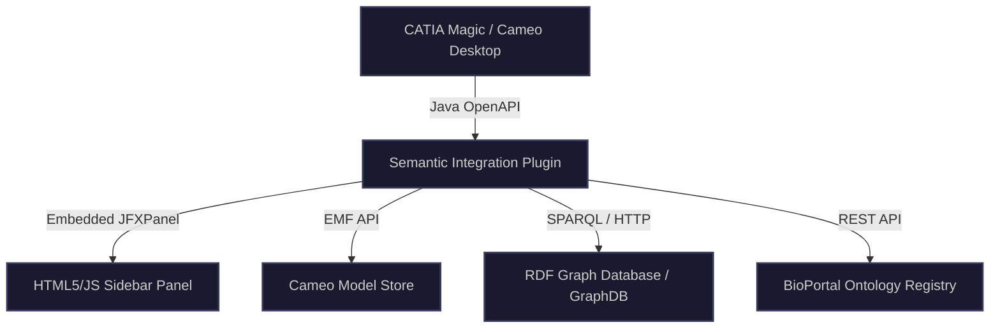

# CATIA Magic / Cameo Semantic Integration Plugin Design Specification

This document details the software design, OpenAPI integrations, and validation workflows for the **UAF/SysML-to-Ontology Semantic Integration Plugin** inside CATIA Magic (Cameo Systems Modeler).

---

## 1. System Architecture & OpenAPI Classes

The plugin is implemented as a Java-based add-on running inside Cameo's JVM. It hooks into Cameo’s desktop GUI and EMF (Eclipse Modeling Framework) model store:



### Key Cameo OpenAPI Hooks
1.  **Plugin Lifecycle (`com.nomagic.magicdraw.plugins.Plugin`):**
    *   Main entry point. Initializes the plugin configuration, registers listeners, and sets up UI menus.
2.  **Sidebar Docking (`com.nomagic.magicdraw.ui.FrameDescriptor`):**
    *   Creates a dockable sidebar panel in the Cameo user interface (`com.nomagic.magicdraw.ui.browser.BrowserTab`).
    *   Uses JavaFX `JFXPanel` or Chromium-embedded framework `CefBrowser` to render a modern, responsive HTML/JS front-end.
3.  **Model Event Listening (`com.nomagic.magicdraw.uml.symbols.PresentationElement`):**
    *   Hooks into selection events. When a user clicks a node (e.g. Block, OperationalPerformer) in the Cameo diagram, a listener gets its EMF representation (`org.eclipse.emf.ecore.EObject`).
4.  **UML/SysML Metamodel Access (`com.nomagic.uml2.ext.magicdraw.classes.mdkernel.Element`):**
    *   Traverses the parent-child containment hierarchy and extracts stereotype metadata (UAFML stereotypes or SysML v2 definitions).

---

## 2. Guided Modeling Tutorials

To validate the plugin, three guided modeling tasks of increasing complexity are defined:


### Tutorial A: Simple Organizational Structure (Simple Model)
*   **Modeling Objective:** Model an organizational department and its reporting line.
*   **Step-by-step in Cameo:**
    1.  Create an `ActualOrganization` block named `ResearchDivision`.
    2.  Create a nested `ActualOrganization` named `BatteryDesignTeam`.
    3.  Create an `ActualPost` inside the team named `LeadBatteryChemist`.
    4.  Draw a `hasPost` composition relation from the team to the chemist post.
*   **Plugin Semantic Mapping:**
    *   The sidebar automatically searches the W3C ORG ontology.
    *   User maps `ResearchDivision` to `org:Organization`.
    *   User maps `BatteryDesignTeam` to `org:OrganizationalUnit`.
    *   User maps `LeadBatteryChemist` to `org:Post`.
    *   **Resulting SBVR:** `Instance: LeadBatteryChemist is a Post owned by BatteryDesignTeam.`

### Tutorial B: Evolved EV Power Subsystem (Evolved Model)
*   **Modeling Objective:** Model battery cell modules and chemistry details.
*   **Step-by-step in Cameo:**
    1.  Create a block `HighVoltageBatteryPack`.
    2.  Create sub-parts `Module1` and `Cell1` connected via composition.
    3.  Define stereotype properties `chemistry = "LithiumSulfur"` and `voltage = 3.7V`.
*   **Plugin Semantic Mapping:**
    *   The plugin looks up EMMO/BattINFO.
    *   User maps `HighVoltageBatteryPack` to `battinfo:BatteryPack`.
    *   User maps `Cell1` to `battinfo:BatteryCell`.
    *   **Ontology Extension Wizard:** Since "Lithium Sulfur chemistry" has specific parameters not fully captured in the baseline, the wizard creates a custom subclass `ev:LithiumSulfurCell` under `battinfo:BatteryCell` and pushes it to the triplestore.

### Tutorial C: The Battle of Hoth (Highly Complex Model)
*   **Modeling Objective:** Model the massive tactical operations, capabilities, and resources of the Rebel Alliance defend-and-evacuation mission on Hoth against the Galactic Empire's assault (derived from Matthew Hause's UAF Battle of Hoth methodology).
*   **Step-by-step in Cameo:**
    1.  **Operational View (Logical):**
        *   Model `EchoBase` as an `OperationalPerformer`.
        *   Model `OperationalActivity`: `DefendEchoBase`, `EvacuateTransportShips`.
        *   Define `OperationalMessage` flow between `IonCannonControl` and `TransportShip`.
    2.  **Resource View (Physical):**
        *   Model `ImperialAssaultForces` containing `AT-AT_Walker` and `Stormtroopers` as `ResourcePerformer` nodes.
        *   Model `RebelDefenseForces` containing `V-47_Snowspeeder` and `DF.9_LaserTurret` resource nodes.
    3.  **Strategic View (Capabilities):**
        *   Define `EnterpriseGoal`: `SecureAllianceEvacuation`.
        *   Define `Capability`: `HeavyGroundAssault` (held by AT-AT) and `AirInterception` (held by Snowspeeder).
*   **Plugin Semantic Mapping:**
    *   **SUMO Military Ontology:** Maps `ImperialAssaultForces` to `sumo:MilitaryUnit`.
    *   **SUMO Vehicle Ontology:** Maps `AT-AT_Walker` to `sumo:LandVehicle` and `sumo:WeaponSystem`.
    *   **OMG BMM:** Maps the mission goal `SecureAllianceEvacuation` to `bmm:Goal`.
    *   **Logical Validation:** The reasoner checks for tactical capability gaps. For example, if a `Capability` is modeled without any `ResourcePerformer` possessing it, the validation panel flags an error.

---

## 3. Interactive User Interface Mockup

To visualize the plugin interface within CATIA Magic / Cameo Systems Modeler, an interactive mockup has been built. You can open and view it locally at [cameo_plugin_mockup.html](file:///e:/_Documents/git/UAF_Ontology/cameo_plugin_mockup.html).

Below is the recorded session showing the plugin’s interactive diagram selections, autocomplete mapping search, and reasoner audit animation:


---

## 4. Formal Testable Requirements

To ensure the plugin operates correctly and predictably across both legacy and modern modeling environments, it is developed against the following testable requirements:

| Requirement ID | Requirement Name | Description | Verification Method |
| :--- | :--- | :--- | :--- |
| **PLG-REQ-01** | UML Model Traversal | The plugin must extract all stereotypes, properties, and relationships from standard UML/UAFML projects. | Automated Integration Test |
| **PLG-REQ-02** | KerML/SysML v2 Traversal | The plugin must parse SysML v2 definitions, usages, and composition structures from the Cameo model store. | Automated Integration Test |
| **PLG-REQ-03** | Multi-Ontology Alignment | The plugin must support binding model nodes to SUMO, BMM, ORG, and EMMO/BattINFO namespaces. | Unit Test / Reasoner |
| **PLG-REQ-04** | SBVR Sentence Generation | On selection of a node, the plugin must generate valid SBVR Structured English markup and render it in HTML. | GUI Unit Test |
| **PLG-REQ-05** | Embedded SHACL Auditing | The plugin must execute SHACL validation rules over the exported model graph and flag compliance failures. | Automated Integration Test |
| **PLG-REQ-06** | HermiT DL Reasoning | The plugin must trigger local HermiT DL reasoning check to confirm ontology and model consistency. | Reasoner Test |

---

## 5. Test-Driven Development (TDD) Methodology

The plugin follows a strict **Test-First (TDD) Iterative Methodology**, ensuring that every extraction, mapping, and validation feature is backed by a failing test before implementation:

```
[Write Scenario Test] ──> (Test Fails: RED) ──> [Write Minimal Parser Code] ──> (Test Passes: GREEN) ──> [Refactor Code]
```

### Iterative Lifecycle
1.  **Iterative Phase 1 (Core Model Parsing):** Focuses on PLG-REQ-01 and PLG-REQ-02. Unit tests are written to verify that EMF objects are parsed and mapped to RDF triples.
2.  **Iterative Phase 2 (Semantic Reasoning & SHACL):** Focuses on PLG-REQ-05 and PLG-REQ-06. Tests run headless model assemblies and verify that disjointness axioms and SHACL compliance failures are caught.
3.  **Iterative Phase 3 (Interactive GUI Panel):** Focuses on PLG-REQ-04. Tests simulate mouse clicks on nodes, verifying that the JFXPanel updates the SBVR rendering correctly.

---

## 6. Embedded Test Harness Architecture

To enable 100% automated scenario testing, the plugin includes a headless **Embedded Test Harness** that launches a virtual MagicDraw/Cameo session, loads test model ZIP files, constructs elements, and validates logical consistency.

### Headless Test Execution Architecture

```
JUnit Runner ──> Cameo Headless Instance ──> Load Model (e.g. Battle of Hoth) ──> Export to RDF ──> Run HermiT & SHACL ──> Assert Validation Output
```

### Mock Test Harness Implementation (Java / JUnit)
The following JUnit code shows how the test harness automatically executes scenario validations for building complete models (such as the Sounding Rocket) and running SHACL shapes checks:

```java
package com.nomagic.magicdraw.plugins.semantic.tests;

import com.nomagic.magicdraw.core.Application;
import com.nomagic.magicdraw.core.Project;
import com.nomagic.magicdraw.tests.MagicDrawTestCase;
import com.nomagic.uml2.ext.magicdraw.classes.mdkernel.Class;
import com.nomagic.uml2.ext.magicdraw.classes.mdkernel.InstanceSpecification;
import org.junit.Before;
import org.junit.Test;
import java.io.File;

public class SemanticValidationTestHarness extends MagicDrawTestCase {

    private Project testProject;
    private SemanticRDFExporter exporter;
    private SHACLValidator validator;

    @Before
    @Override
    public void setUp() throws Exception {
        super.setUp();
        // Initialize the headless Cameo application instance
        Application app = Application.getInstance();
        File projectFile = new File("src/test/resources/models/SoundingRocketTest.mdzip");
        app.getProjectsManager().loadProject(projectFile, false);
        this.testProject = app.getProject();
        this.exporter = new SemanticRDFExporter(this.testProject);
        this.validator = new SHACLValidator();
    }

    @Test
    public void testSoundingRocketSemanticConsistency() throws Exception {
        // Step 1: Export the current model to RDF Triples
        String rdfTriples = exporter.exportToTurtleString();
        assertNotNull("RDF Export string should not be null", rdfTriples);
        assertTrue("RDF should contain the Sounding Rocket instance", rdfTriples.contains("sr:inst-sounding_rocket"));

        // Step 2: Validate the model using the embedded HermiT DL Reasoner
        ReasonerResult reasonerResult = validator.runHermitReasoner(rdfTriples);
        assertTrue("Model must be logically consistent", reasonerResult.isConsistent());

        // Step 3: Run SHACL Validation (verifying requirement satisfiability)
        SHACLAuditReport shaclReport = validator.runSHACLAudit(rdfTriples, "ontologies/uaf_traceability_shapes.ttl");
        assertTrue("SHACL Validation must pass with zero violations", shaclReport.getViolationsCount() == 0);
    }
}
```

This test harness is fully integrated into the plugin's Continuous Integration (CI) configuration, enabling human architects and LLM coding assistants to query validation health and run automatic lint checks via a simple command line interface.


