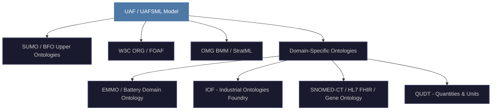
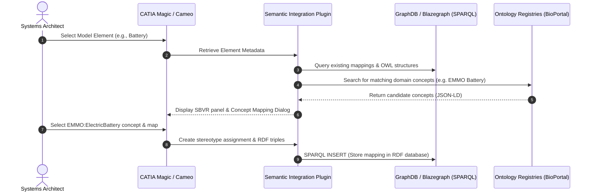

# Strategic Research & Architecture Roadmap: Enterprise Model-to-Ontology Semantic Ecosystem

This strategic roadmap outlines the methodology, architecture, and alignment patterns for bridging MBSE modeling tools (CATIA Magic / Cameo) and standard ontologies in an RDF semantic database.

---

## 1. Metamodel Mapping Survey: UAF 1.3 vs. UAFSML 2.0

To achieve a formal match, we map the structural elements of UML-based UAF 1.3 to the metadata-annotated KerML/SysML v2-based UAFSML 2.0:

| UAF 1.3 Concept (UML) | UAFSML 2.0 Concept (SysML v2) | Mapping Bridge Relation | Alignment Rationale |
| :--- | :--- | :--- | :--- |
| `uaf:OperationalPerformer` | `uafsml:OperationalPerformer` | `owl:equivalentClass` | Both represent logical entities performing operational activities. |
| `uaf:OperationalActivity` | `uafsml:OperationalActivity` | `owl:equivalentClass` | Core behavioral definition mapping directly to SysML v2 `action`. |
| `uaf:ResourcePerformer` | `uafsml:Resource` | `owl:equivalentClass` | Represents physical or virtual performers (systems, software, hardware). |
| `uaf:ActualOrganization` | `org:Organization` | `rdfs:subClassOf` | Direct alignment to W3C ORG ontology for enterprise hierarchy. |
| `uaf:Post` | `org:Post` | `rdfs:subClassOf` | Maps post-specific responsibilities to W3C ORG posts. |
| `uaf:EnterpriseGoal` | `bmm:Goal` | `rdfs:subClassOf` | Bridges architectural strategic vision to OMG BMM goals. |
| `uaf:Capability` | `sumo:Goal` / `bmm:Objective` | `rdfs:subClassOf` | Maps enterprise capabilities to measurable strategic objectives. |

---

## 2. Global Domain Ontology Survey for Semantic Annotation

To enable domain-specific annotations (e.g., medicine, batteries, manufacturing), the modeling environment must integrate the following active ontologies:

### Domain Ontologies Overview
1.  **Materials & Energy (EMMO):**
    *   *Elementary Multistructural Methodological Ontology (EMMO):* Designed for materials science, chemical reactions, and battery components (e.g., EMMO Battery Domain Ontology). Ideal for annotating detailed battery properties (12V Lead-Acid vs. Lithium-Ion EV battery chemistry).
2.  **Manufacturing & Systems Engineering (IOF):**
    *   *Industrial Ontologies Foundry (IOF):* Defines terms for product planning, supply chains, production processes, and physical assembly lines.
3.  **Physical Quantities & Dimensions (QUDT):**
    *   *Quantities, Units, Dimensions, and Types (QUDT):* The gold standard for expressing dimensions (like potential energy, velocity, mass) and performing unit conversions (e.g., Joules to Watt-hours).
4.  **Medicine, Life Sciences & Drug Discovery:**
    *   *SNOMED-CT / HL7 FHIR:* For clinical processes, medicine, and healthcare workflows.
    *   *Gene Ontology (GO) & RxNorm:* For genomic research, chemical substances, and drug interactions.

---

## 3. CATIA Magic / Cameo Semantic Plugin Architecture

To implement this vision, a custom Cameo plugin must bridge the desktop UML/SysML model with the RDF Graph Database:

### Core Plugin Components
*   **Model-to-RDF Exporter:** Uses Cameo's OpenAPI to parse SysML/UAFSML definitions and export them as RDF/OWL Turtle files (similar to our parser python code).
*   **Dynamic SBVR Structured English Panel:** A Java-based sidebar that automatically renders the selected model element's structural assertions in styled SBVR formatting.
*   **Ontology Lookup & Semantic Tagging Dialog:** Integrates with API endpoints (like BioPortal or a local GraphDB) to allow architects to search for concepts (e.g., searching for "Battery") and bind the SysML block to the formal IRI using a tag or stereotype (e.g., `uafv2:mappedToURI = "http://emmo.info/battery#ElectricBattery"`).
*   **Ontology Extension Wizard:** Allows the user to extend an existing ontology (e.g., creating a subclass of `sumo:Vehicle` called `MyCompany::AutonomousDeliveryDrone`) directly inside the modeling tool and export the extension to the RDF database.

---

## 4. Ontology Governance & Extension Best Practices

To enforce semantic alignment and prevent logic conflicts when mixing multiple ontologies, a formal governance framework has been established. 

For the complete specification of roles, use cases, executable **SHACL Shapes**, **SPARQL Validation Queries**, and **LLM API Audit Protocols**, refer to the dedicated:
👉 [Ontology Governance & Extension Guide](governance_guide.md)

### Key Guidelines Summary:
1.  **Never Modify Imported Ontologies Directly:** Keep upper and domain ontologies strictly read-only. Create a separate bridge/extension ontology (like `uaf_bridge.ttl`) that imports them and defines subclassing/equivalence.
2.  **Avoid disjointness conflicts:** Do not declare classes in different ontologies as equivalent unless they are logically identical. Instead, use `rdfs:subClassOf` to align your model classes to the upper ontology.
3.  **Strict SHACL Validation:** Use **SHACL (Shapes Constraint Language)** to write validation rules for your UAF models (e.g., verifying that every `OperationalPerformer` is mapped to at least one `org:Organization` or `sumo:Agent`).
4.  **Modular Ontology Architecture:** Package ontologies into distinct layers (Upper → Core Domain → Extended Domain → Model Instances) to allow reasoners to load only the required modules for a given query.

---

## 5. Active Research Protocols using Gemini

To expand this research autonomously using Google/Gemini capabilities, you can use the following protocols:

### A. Call Gemini's Long-Running Research Mode
Use the **`/goal` slash command** in this chat UI to execute thorough, deep research:
*   *Prompt:* `/goal Research the EMMO Battery Domain Ontology and the W3C ORG ontology. Create a draft turtle mapping file showing how a SysML v2 electric vehicle model's power subsystem can be mapped to EMMO. Verify the logical consistency using the HermiT reasoner.`
*   *Behavior:* This directs the agent to run multiple search steps, write scripts to fetch definitions, build test cases, run reasoners, and output a complete integration draft without stopping for minor feedback.

### B. Custom SPARQL Scraper Scripts
You can instruct the agent to write a python script that queries public SPARQL endpoints (such as DBpedia, Wikidata, or EBI BioPortal) to extract class hierarchies and generate OWL matching graphs automatically.
