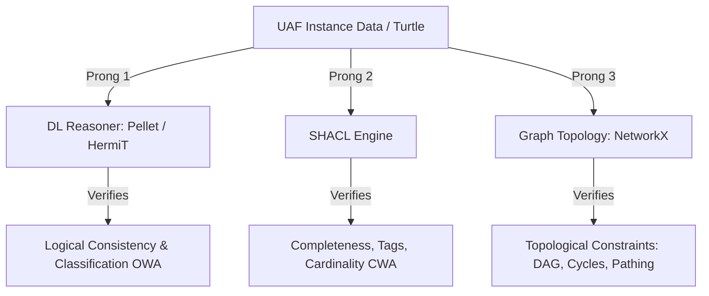

# Foundational Ontologies and Reasoning in Digital & Systems Engineering

This document provides a comprehensive report comparing foundational (upper-level) ontologies, analyzing their strengths and weaknesses in engineering contexts, and outlining the implications of semantic reasoning. It incorporates recent guidelines from the **SERC Handbook on Digital Engineering with Ontologies (2.0, 2025)** and **Tania Tudorache's Collaborative Engineering Mappings (TU Berlin)** to support the semantic alignment of UAF with engineering domains, systems engineering (SE), and enterprise architecture (EA).

---

## 1. Foundational Ontologies: Pluses, Minuses, and Trade-offs

A **foundational (or upper-level) ontology** provides the domain-independent categories (e.g., objects, events, dispositions) that serve as a shared semantic backbone.

| Ontology | Paradigm | Key Pluses (Strengths) | Key Minuses (Weaknesses) | Engineering & Systems Engineering Use Case |
| :--- | :--- | :--- | :--- | :--- |
| **gUFO** | 3D (Endurantist) | • Mathematically rigorous treatment of properties, relations, and roles.<br>• Excellent representation of **capabilities** as ontological *dispositions*.<br>• Easy mapping to UML/SysML stereotypes. | • Strict disjointness between Objects (Substantials) and Events (Occurrents) makes modeling dual-nature engineering elements (e.g., interaction blocks) complex.<br>• Less industry-standard adoption. | Conceptual modeling, SysML profile stereotyping, and early-phase logical architecture validation. |
| **BFO** | 3D (Endurantist) | • **ISO/IEC 21838-2 Standard**.<br>• Dominated by the **Industrial Ontologies Foundry (IOF)** and biomedical foundry.<br>• Massive ecosystem of modular domain ontologies. | • Lacks native, built-in definitions for social/enterprise concepts (relying on extensions like Common Core Ontologies).<br>• 3D disjointness creates modeling hurdles for dynamic engineering systems. | Industrial systems, supply chain integration, manufacturing (PLM) data integration, and physical asset management. |
| **DOLCE** | 3D (Cognitive) | • Excellent representation of social constructs, organizational roles, policies, plans, and cognitive descriptions.<br>• Separates physical matter from functional objects. | • Highly abstract and complex learning curve.<br>• Less focused on physical/mechanical engineering domains. | Enterprise Governance, Capability-based planning, security policies, and stakeholder goal alignment. |
| **IDEAS Group** / **BORO** | 4D (Spatiotemporal) | • Unified 4D paradigm (objects and events are both space-time extents).<br>• Natively resolves structural-behavioral duality (no Continuant/Occurrent disjointness).<br>• Historical foundation of **UPDM, DoDAF 2.0, and MODAF**. | • Extremely counter-intuitive for humans (objects are viewed as "4D worms" in space-time).<br>• Standard DL reasoners struggle with the massive number of temporal-part relations required. | Defense architecture federation, legacy DoDAF/MODAF database alignment, and multi-system lifecycle tracking. |

---

## 2. Reasoning Implications: OWA, CWA, and Practical Architectures

Integrating a semantic reasoner with your UAF models introduces key logical implications. 

### 2.1 The Two Reasoning Worlds: OWA vs. CWA
Traditional database systems operate under the **Closed World Assumption (CWA)**, while semantic web technologies (OWL/RDF) operate under the **Open World Assumption (OWA)**:

*   **Open World Assumption (OWA) / Description Logic (DL):**
    *   *Rule:* If a statement is not explicitly stated in the database, it is assumed to be **unknown**, not false.
    *   *Example:* If a `System` is defined as having `at least 2 Port connections`, and you only declare `1 Port` connection in your file, an OWA reasoner (e.g., Pellet or HermiT) will **not** report an error. It assumes the second port exists but has simply not been declared yet.
    *   *Usage:* Discovery of hidden dependencies, consistency checks, and classification.
*   **Closed World Assumption (CWA) / Graph Validation:**
    *   *Rule:* If a statement is not explicitly stated, it is assumed to be **false**.
    *   *Example:* In the same scenario above, a CWA engine will immediately flag a violation because exactly one port connection exists in the graph.
    *   *Usage:* Model verification, data completeness checks, and conformance validation.

### 2.2 The Semantic System Verification Library (SSVL) Architecture
Following the **SERC Handbook (2025)**, the recommended digital engineering verification architecture is a **three-pronged hybrid approach**:



1.  **Prong 1: DL Reasoning (Open World):** Validates class hierarchies, taxonomy correctness, and infers implicit relationships (e.g., checking if `Termination points shall not connect to like points` using disjointness).
2.  **Prong 2: SHACL Validation (Closed World):** Checks constraints that require completeness, such as ensuring all value properties are tagged with loaded ontology terms (cardinality constraints and tag existence).
3.  **Prong 3: Graph Topology Analysis:** SPARQL queries extract subgraphs from your triplestore and feed them into specialized libraries (like Python's `NetworkX`) to check topological constraints, such as verifying that systems connections form a Directed Acyclic Graph (DAG) (detecting circular loop faults).

---

## 3. Data Representation: Alternatives to OWL

You do **not** have to keep your instance data in native OWL files. Standard practice separating the ontology schema (TBox) from the instance data (ABox) allows several representations:

### 3.1 RDF/Turtle and JSON-LD
*   **TBox (Schema):** Defined in OWL 2 DL (using Turtle `.ttl` syntax) for reasoning and validation rules.
*   **ABox (Instance Data):** Represented in **JSON-LD** (JSON for Linking Data). This allows engineering tools (which natively output JSON) to format their systems models as standard JSON while referencing the UAF ontology via a `@context` tag.
*   *Benefit:* Web developers and systems tools can read/write standard JSON without needing specialized semantic web libraries.

### 3.2 Labeled Property Graphs (LPGs) vs. RDF Triplestores
*   **LPGs (e.g., Neo4j):** Highly efficient for graph traversal, pathfinding, and topology analysis (Prong 3).
*   **RDF Triplestores (e.g., GraphDB, Jena):** Essential for DL reasoning (Prong 1) and SHACL (Prong 2).
*   *Alternative Architecture:* Maintain instance data in an LPG (Neo4j) for fast execution, and project it to RDF via semantic middleware (like Neo4j Semantics / `n10s`) when reasoning or formal compliance validation is required.

### 3.3 Next-Generation Semantics: RDF-star (RDF 1.2)
The next generation of RDF standardizes **RDF-star (RDF-star / RDF 1.2)**:
*   *The Problem in RDF 1.1:* If you want to attach metadata (like `xmiID` or `author`) to a relationship/statement (e.g., `ex:SystemAlpha uaf:exhibitsCapability ex:CapabilityBeta`), you have to use complex RDF Reification or intermediate classes.
*   *The RDF-star Solution:* Natively supports **nested triples** (statements about statements):
    ```turtle
    << ex:SystemAlpha uaf:exhibitsCapability ex:CapabilityBeta >> uaf:xmiID "303aa2d6-fbef" .
    ```
    This completely eliminates the need to abuse datatype/annotation properties or create intermediate connection blocks, simplifying the UAF OWL mapping.

---

## 4. Augmenting UAF to Align with Engineering Domains

To use the UAF ontology to build rich **UAFML (UAF Modeling Language)** models that interoperate with mechanical, electrical, and systems engineering, we incorporate **Tania Tudorache's Collaborative Engineering Ontology** framework.

Tudorache's framework proposes a **hybrid modular ontology structure**, dividing engineering systems into five interconnected sub-ontologies:

```
                  [ Foundational Ontology (gUFO / BFO) ]
                                    │
                  [ Shared Domain Vocabulary / Interlingua ]
                                    │
      ┌──────────────┬──────────────┼──────────────┬──────────────┐
      ▼              ▼              ▼              ▼              ▼
[Components]   [Connections]    [Systems]     [Requirements] [Constraints]
      │              │              │              │              │
      └──────────────┴──────────────┼──────────────┴──────────────┘
                                    ▼
                      [ Local Tool / Viewpoint Models ]
```

1.  **Components Ontology:** Represents structural components, functional interfaces, ports, and decomposition.
2.  **Connections Ontology:** Models topological connections, flow paths, and energy/material/information exchanges.
3.  **Systems Ontology:** Represents the system state space, parameters, operational profiles, and system of systems (SoS) boundaries.
4.  **Requirements Ontology:** Formalizes functional, non-functional, and physical requirements.
5.  **Constraints Ontology:** Represents mathematical and logical equations that restrict component/system variables.

### 4.1 Implementation: Mapping UAF to Tudorache's Engineering Modules

By aligning UAF concepts with these modules under BFO/gUFO, we create a rich interlingua:

```turtle
@prefix uaf: <http://purl.org/uaf/ontology#> .
@prefix eng: <http://purl.org/collaborative/engineering#> .

# Systems Module: Mapping UAF Resource/System to Tudorache System
uaf:System rdfs:subClassOf eng:System .

# Components Module: Mapping UAF Port and Interface to Component/Port
uaf:ResourcePort rdfs:subClassOf eng:Port .

# Connections Module: Mapping UAF ResourceConnector to Connection
uaf:ResourceConnector rdfs:subClassOf eng:Connection .

# Requirements Module: Mapping UAF SecurityControl / Requirement to Requirement
uaf:SecurityControl rdfs:subClassOf eng:Requirement .
```

---

## 5. Path to UAFML: Using Semantics to Build System of Systems Models

The final goal is to leverage this enriched ontology to automate the creation of **UAFML models** (which represent SysML v2 profile implementations for UAF).

### The UAFML Generation Pipeline
```
 Enriched OWL Ontology ──► SPARQL Rules ──► SysML v2 / UAFML API ──► UAFML Model
```

1.  **Step 1: Instantiation (ABox):** Systems engineers model operational capabilities, flows, and architectures in light-weight JSON-LD or Turtle using the enriched UAF ontology.
2.  **Step 2: Semantic Validation & Inference:** Run Pellet (Prong 1) to verify system consistency and SHACL (Prong 2) to ensure all required engineering parameters are complete.
3.  **Step 3: SysML v2/UAFML Code Generation:** Execute SPARQL CONSTRUCT queries or Python templates (utilizing the UAF mapping rules) to translate the validated semantic graph into **SysML v2 Manchester / UAFML text syntax**:
    ```sysml
    package 'UAFML Model' {
        part def SystemAlpha {
            attribute xmiID = "303aa2d6-fbef";
            port inputPort : ResourcePort;
        }
    }
    ```
4.  **Step 4: Load to Catia Magic / Cameo:** Push the generated UAFML code directly into the systems modeling tool via the Cameo REST/SysML v2 API, resulting in fully populated, syntactically perfect Cameo System Models.
